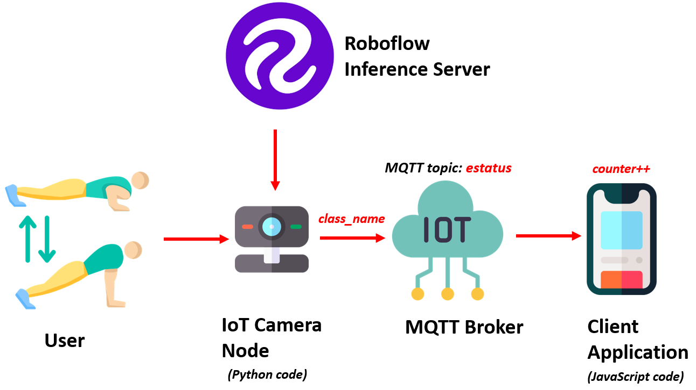
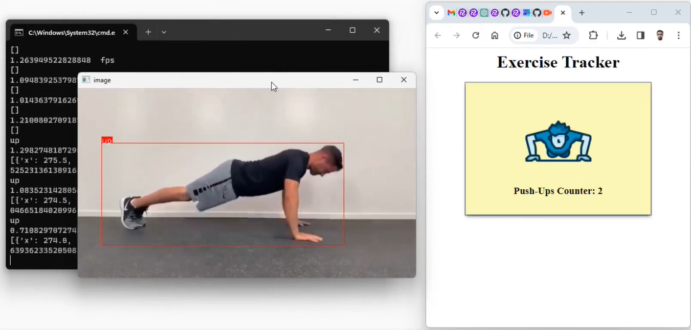

# Exercise Tracker
Exercise tracker project uses the power of Computer Vision and Internet of Things (IoT) technologies to revolutionize fitness routine.
  

  
Follow these steps to run project.  
Step 1. Install dependencies  
<code>pip install roboflow</code> 
<code>pip install paho-mqtt</code>
  
Step 2. Update the <code>.json</code> file and run code with following command.  
<code>python exercise_publisher.py</code>
  
Step 3. Then open a web browser and run JavaScript Application (assuming you have a web server installed on the system).  
<code>http://localhost/exercise_subscriber.html</code>  
Final output of the System  
  
<iframe width="420" height="315"
src="https://youtu.be/uwZbspDpBmQ">
</iframe>

